# Cahier des Charges

## Objectif du projet 
Nous allons programmer un jeu du type **Bubble shooter**. L’objectif du jeu est d’éclater des bulles de couleur (canvas). On doit viser et tirer sur les bulles de la même couleur que la bille dans le lanceur : les bulles sont éliminées si elles forment au minimum une chaîne de 3 bulles de même couleur connectées. Les billes tombent si elles ne sont pas soutenues par des billes au-dessus. Les billes rebondissent sur les parois (murs verticaux). Le jeu est fini lorsque toutes les bulles sont éclatées (gagné) ou si le joueur n’a plus la place de tirer une balle (perdu, la dernière ligne de billes se trouve juste au-dessus du canon). Il existe aussi d’autres modes de jeu.

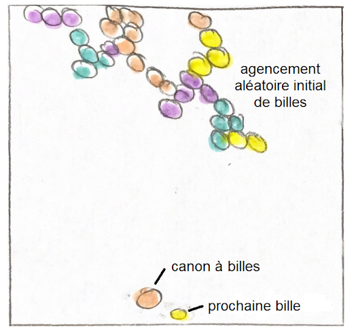

## Commandes du jeu
 - `Utiliser la souris` pour viser avec le lanceur
 - `Clic gauche` pour lancer une bulle (bloque la direction canon-position de la souris au moment du clic qui décrit la trajectoire de la bille)
 - On appuie sur la lettre `C` du clavier pour changer la bille qu’on s’apprête à tirer avec la suivante (jaune sur le schéma) 

## Fonctionement du programme
Le programme se divise en quatres étapes principales :
 1. Initialisation de l’interface (GUI, code structuré en classes) et du début de partie : les billes générées aléatoirement pour initialiser la partie ne respectent pas la règle “3 billes de couleur identiques à la suite sont éliminées”. Ainsi, on peut générer des blocs de plus de 3 billes de même couleur successives, qui seront éliminées dès le contact avec une bille de même couleur lancée par le joueur.
 2. Tour du joueur : évaluation de la trajectoire de la bille et envoi de celle-ci
 3. Etude de sa position ainsi que de ses voisins
 4. Conséquence de l’étude : quelles billes le programme doit-il enlever?

Il y a aussi une lecture de fichiers : il y aura le choix entre plusieurs niveaux de difficulté qu’on sauvegardera dans un fichier .txt qu’on lira. On sauvegarde aussi certains paramètres, notamment les données des parties: (ex: meilleur score, partie en cours, …) dans un fichier csv qu’on lira. Timer : mouvement des billes.

## Paramètres variables
 - On peut choisir d’échanger la balle avec la suivante (ordre des billes généré aléatoirement).
 - Choix de la direction du tir/trajectoire. Choix de la difficulté (et du mode de jeu).
 - On peut aussi choisir la manière dont le score est calculé (nous envisageons d’inclure le nombre de bulles éclatées, le temps du tir et le nombre de coups réussis en chaîne dans son calcul).

## Interface envisagée
Des bulles de différentes couleurs sont disposées aléatoirement sur l’interface graphique (elles doivent cependant être collées entre elles ou être en haut de l’écran) → état initial en lançant une partie
En bas de l’interface graphique, on retrouve la balle que l’on souhaite envoyer. On peut également visualiser la couleur de la prochaine balle (petite balle jaune sur le schéma).
On trouverait sur un des côtés le chronomètre du joueur ainsi que le meilleur score enregistré et le score actuel du joueur (paramètres divers).
On peut aussi ajouter un bouton pour rappeler les règles du jeu (comment jouer). Les boutons disponibles évolueront en fonction de l’état du programme (pendant une partie, menu principal…). 

----------

# Hors cahier des charges

## Idées supplémentaires/pistes d’amélioration
 - Ajouter un mode de jeu alternatif ou au lieu de lancer vers le haut, on lance la balle depuis un côté (ce qui change donc sa trajectoire)
 - Bouton pause et possibilité de sauvegarder la partie
 - Les bulles de départ sont générées aléatoirement par groupes, non pas complètement au hasard 1 par 1
 - Différents niveaux (en fonction de nombre de couleurs différentes de bulles, du nombre de rangées remplies initialement, de la taille des billes : + de billes dans une ligne si elles sont + petites)
 - Extraire un niveau d’une image (générer les bulles et les couleurs disponibles par rapport à celles de l’image)
 - Donner à certaines balles des effets uniques (éclate toutes les bulles adjacentes, change la couleur d’un groupe de bulles…)
 - Comptage des points, score
 - Ajouter des statistiques de jeu (bulles éclatées par tir, plus grande chaîne, …)
 - Autre mode de jeu → rapidité : les lignes descendent de plus en plus vite, il faut alors se débarrasser des billes avant qu’elles ne touchent le bas de la fenêtre. Quand la dernière ligne est éliminée, on progresse d’une ligne vers le haut : on peut remonter ainsi à l’infini.


# Fonctionnement de git
## Setup
Executez la commande suivante dans le dossier parent pour récuperer le repo sur votre ordi :
```bash
git clone https://github.com/Spiky-73/BubbleShooter
```

## Workflow
Un repo git est comme un dossier de fichier, mais il fonctionne avec leurs modifications.
Une fois que des fichiers sont modifiées, il faut notifier leurs modifications à git (`add` ou `stage`), puis les enregister (`commit`) et enfin les envoyer sur le cloud (`push`).

On peut aussi récuperer les modification des autres (`pull`) ou se synchroniser avec le cloud (`pull` puis `push`).

Si besoin, on peut aussi faire un backup de nos modifications (`stash`) avant de revenir sur la dernière version du cloud.


## Commandes (dans vs code)
Ces actions permettent d'agir avec le repo distant.
 - Pull : recupère les nouvelles commits depuis le repo.

 - Stage (All) changes : signale à git qu'un fichier a été modifié.

 - Commit : Enregistre localement les modifications. **Utilisez de préférence `Commit and sync` pour éviter les problèmes lors du push** (voir [Réaliser une commit](#réaliser-une-commit)).

 - Push : Envoie les nouvelles commits vers le repo. **Nécessite un pull au préalable.**

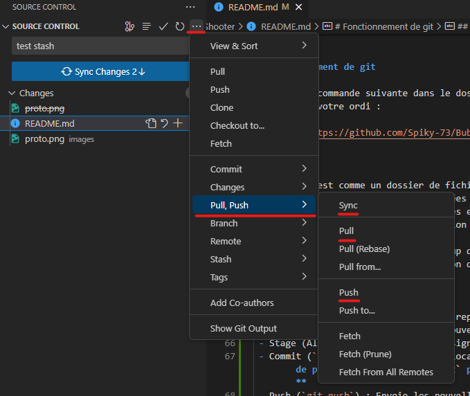

## Réaliser une commit

Pour créer et push une commit, il primordial d'avoir réaliser un `pull` ou `sync` au préalable. (voir [En cas de confits](#en-cas-de-confits) si il y a une erreur).

Il faut d'abord ajouter nos changements en cliquant sur les `+` à coté des fichiers ou le `+` de `Changes` pour tout ajouter (ou exceuter `git add -A` dans le terminal)

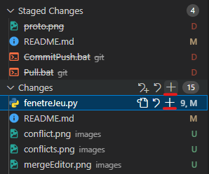

Une fois cela fait, on peut créer la commit en lui donnant un message puis cliquer sur `Commit and sync` pour l'envoyer (voir [En cas de confits](#en-cas-de-confits) si il y a une erreur).

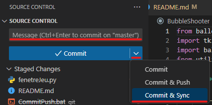

Si on a oublié le message de la commit, un éditeur s'ouvre. 
 1. On ajoute le message en bas du fichier.
 3. On valide pour envoyer la commit. On peut aussi fermer le fichier pour l'annuler.

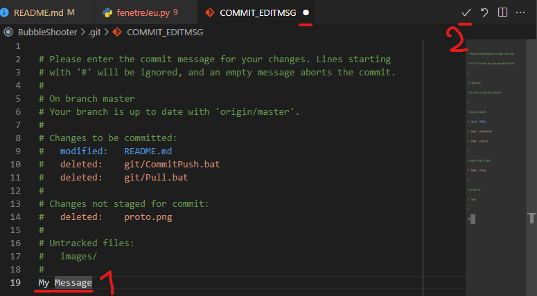

## En cas de confits
Lors d'un push ou d'un pull, il est possible que différentes versions de certain fichiers ne soit pas compatibles par endroits (par ex. si 2 personnes modifie le même code temps on que l'on tente de `push` sans avoir `pull` au préalable).

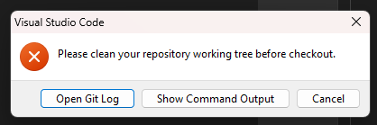

Dans ce cas, 2 solutions sont possible:

### Réaliser un stash **(à utiliser en priorité)**
On réalise une sauvegarde de nos modifications pour ensuite retourner sur une version pour laquelle on peut récupérer les nouvelles commits.
On restore enfin la sauvegarde en resolvant les conflits dans les fichiers.

 1. Réaliser un `Stash` total du dossier et lui donner un nom.

    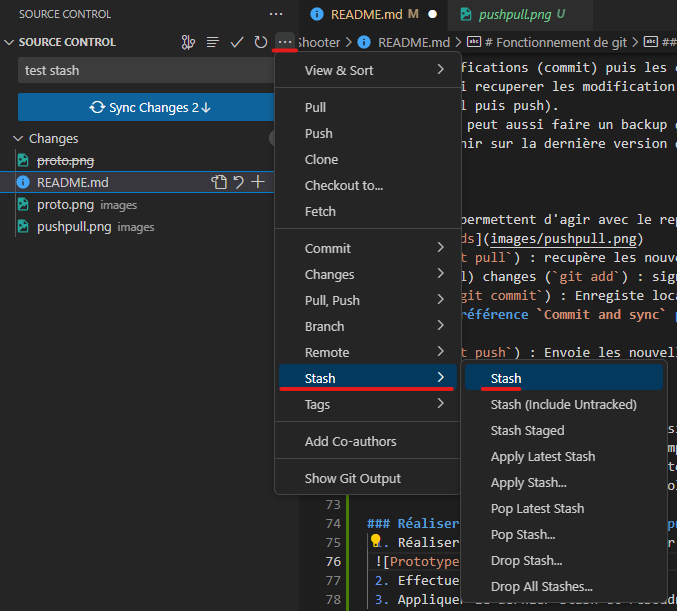
    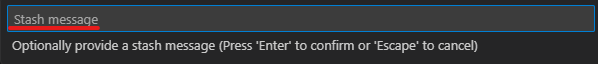

 2. Effectuer un `Pull` ou `Sync`

    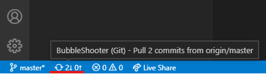

 3. Appliquer le dernier stash.
    
    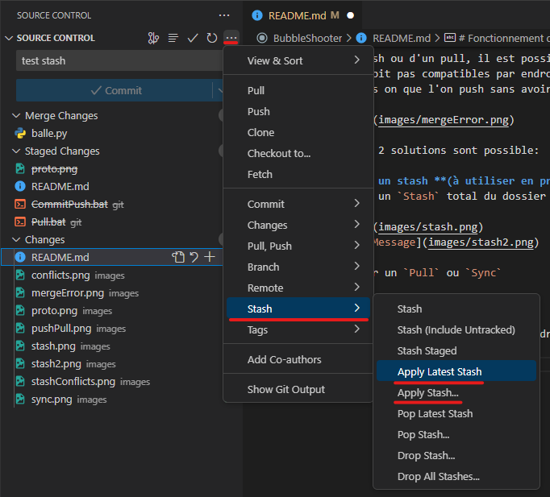

 4. Si il y a des conflits, rechercher tous les fichiers avec un point d'exclamation et les ouvrir. Ces fichiers on des conflits à résoudre.

    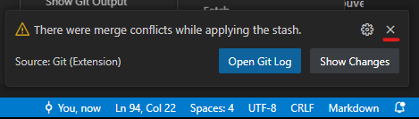

    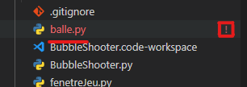

    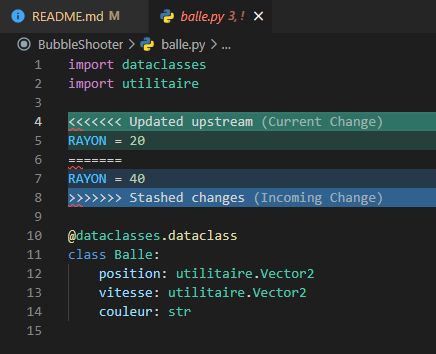

    Pour les résoudre, cliquez sur `Resolve in Merge Editor`.

    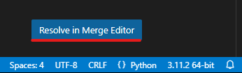

    Un nouvel éditeur s'ouvre, dans lequel on va résoudre les conflits.

     1. Choisir quel version du code conserver grace au bouttons `Accept ###` ou `Ignore`. On peut éditer le code final dans la zone orange du bas (section `Results`).
     2. Passer au conflit suivant et les résoudre comme au dessous jusqu'à ce qu'il ne reste plus de conflits.
     3. Confirmer les changements.
    
    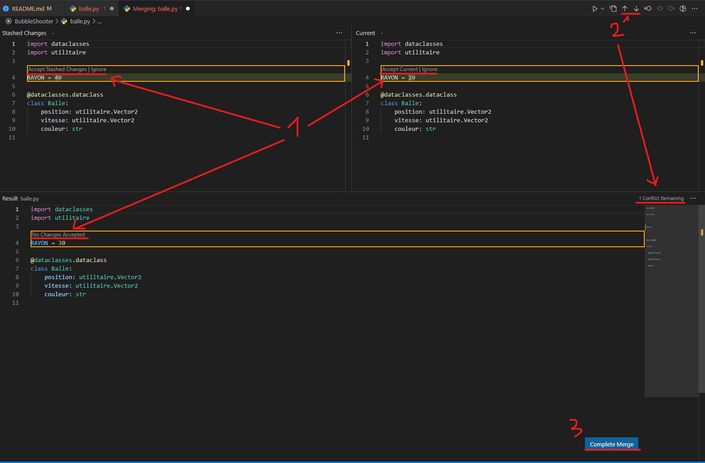

    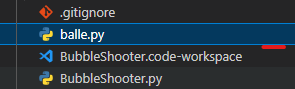
    
### Réaliser un merge
Cette procedure est nécessaire si une commit a été crée mais pas envoyée au moment du `Pull`.

Lors du `Pull`, les conflits sont résolus comme dans [Réaliser un stash](#réaliser-un-stash-(à-utiliser-en-priorité)).

On crée ensuite une commit vide représentant le merge (vs code la nomme automatiquement) puis `push` nos commits.